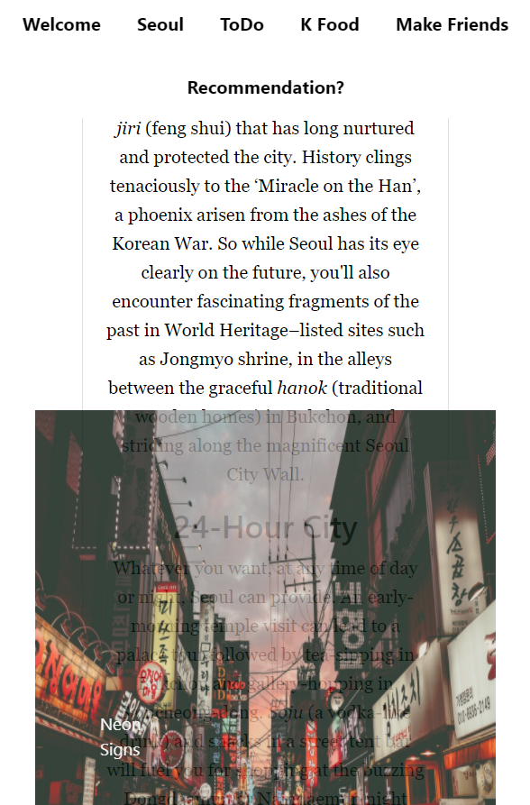

# Go To Seoul :heart_eyes:

#### By **Jiwon Han**

## Table of Contents

* [Instructions](#instructions)
* [Technologies](#Technologies)
* [Glossary](#Glossary)
* [Bugs](#Bugs)
* [Contact](#Contact)

## Instructions

A <strong>Udacity</strong> front-end landing page project. This is a single and static web-page that has travelwise information of Seoul in Korea. There are 5 sections : brief introduction of Seoul, What to do, K Food, Make Friends and Contact. A user is able to navigate all of them by clicking nav-bar menu. Each section has a useful information such as location and other references and nice real photos of Seoul.        

To get started, clone this repository and open `index.html` or visit https://jiwon-seattle.github.io/Go-to-Seoul/.

## Technologies

- HTML
- CSS
- Bootstrap
- Mapbox
- Email feature using a Google Script
- Google Icons & Font Awesome

## Glossary 
- [Bootstrap](https://getbootstrap.com/) : Buttons, Card, Form for styling.  
- Image and Letter Hover Effects : Added interactivity to elements and made effects in CSS.
- Layouts : Used Flex, Grid, Position, Margin, Padding in CSS.
- [Mapbox](https://www.mapbox.com/) : Fetched a map api and displayed popups for certain locations on click with Maki symbols. 
- Responsive Web Design : Used media queries to make fittable pages for all devices and DOM to make sliders and scrolling nav bar with hamburger menu tab in mobile view.
- [Unsplash](https://unsplash.com/) : Used good quality of pictures from there. Appreciate the best photographers! :sparkles:
- [Google Script](https://github.com/dwyl/learn-to-send-email-via-google-script-html-no-server) : Sending a email to me is set by Google Script.
 
 ## Bugs
 1. A Read-More toggling overides the image div when media query is set to mobile version.
 

 ## Contact
 Please contact at email: jiwon1.han@gmail.com.

 *This software is licensed under the MIT license*

Copyright (c) 2020 **_Jiwon Han_**
